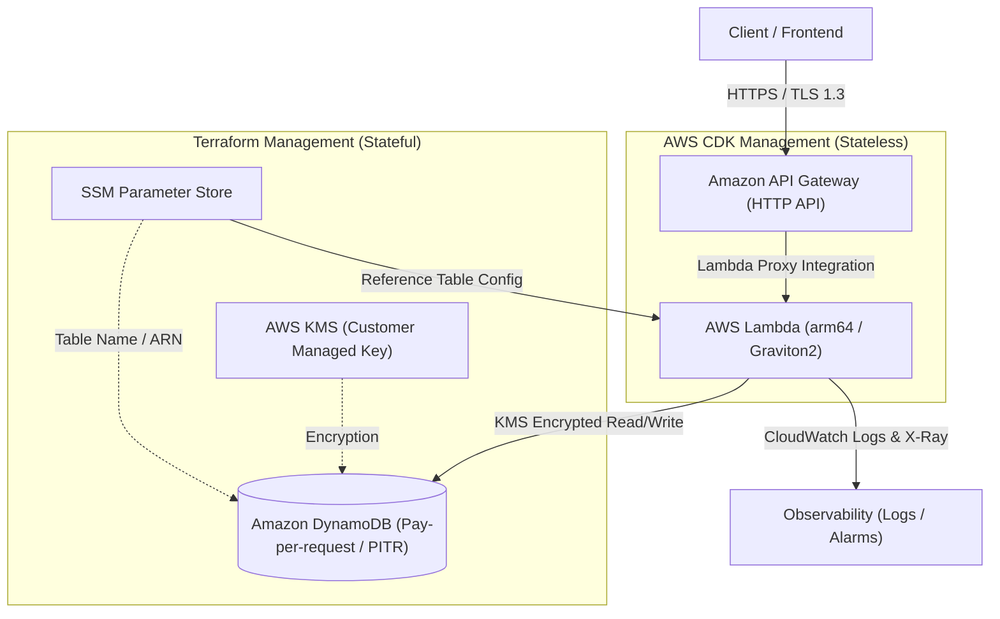

# Serverless Dual-Blade IaC ⚡

AWSのフルマネージドサービスを極限までシンプルかつ堅牢に運用するための、**完全サーバーレスREST API基盤**リポジトリです。

本プロジェクトは、状態管理とデータ保護が最優先されるステートフルリソース（DynamoDB, KMS, SSM）を **Terraform** で固め、アプリケーションと密結合するステートレスリソース（API Gateway, Lambda）を **AWS CDK** で高速展開する、**「IaC二刀流アプローチ」** を採用しています。

---

## 🌟 インフラストラクチャの特徴

- **疎結合な二刀流アーキテクチャ**
  - **Terraform領域**: DynamoDB（オンデマンド、PITR有効、KMS暗号化、削除保護）、AWS Systems Manager (SSM) Parameter Store
  - **AWS CDK領域**: HTTP API (API Gateway)、Graviton2 (arm64) Lambda関数、CloudWatchアクセスログ & X-Ray
- **ゼロトラスト & 最小権限**
  - Lambda実行ロールにはSSMおよびDynamoDBへの必要最小限の権限のみ付与。
- **SSMパラメータによるシームレスな統合**
  - Terraformが出力したリソースARN/テーブル名をCDKがSSM経由で安全に参照し、完全自動結合。

---

## 🏛️ アーキテクチャ構成図



---

## 📁 ディレクトリ構造

```text
.
├── terraform/                  # 【Terraform】基盤・ステートフルリソース
│   ├── main.tf                 # プロバイダー設定、全体統合
│   ├── dynamodb.tf             # テーブル定義、PITR、暗号化設定
│   ├── kms.tf                  # KMS暗号化キー
│   ├── ssm.tf                  # CDKへ引き渡すパラメータ定義
│   ├── variables.tf            # 変数定義
│   └── outputs.tf              # 出力値定義
│
├── cdk/                        # 【AWS CDK】API・アプリケーションリソース
│   ├── bin/
│   │   └── api-app.ts          # CDKエントリーポイント
│   ├── lib/
│   │   └── api-stack.ts        # API Gateway + Lambda 定義 (SSM参照)
│   ├── lambda/                 # Lambda関数ソースコード
│   │   └── handler/
│   ├── package.json
│   ├── tsconfig.json
│   └── cdk.json
│
└── README.md
```

---

## 🚀 デプロイ手順

本構成は **Terraform → AWS CDK** の順序でプロビジョニングを行います。

### 1. 基盤層（Terraform）のプロビジョニング
まずはDynamoDBテーブルおよびSSMパラメータを展開します。

```bash
cd terraform
terraform init
terraform plan
terraform apply
cd ..
```

### 2. アプリケーション層（AWS CDK）のデプロイ
Terraformによって作成されたSSMパラメータを参照し、API GatewayとLambdaを展開します。

```bash
cd cdk
npm install
npx cdk synth
npx cdk deploy
```

デプロイが完了すると、コンソール上にHTTP APIのエンドポイントURLが出力されます。

---

## 🎭 キャスト・クレジット (AI App Factory)

- **企画・要件定義**: agent🔵
- **設計・構成アーキテクト**: agent🍇
- **IaC実装・コード生成**: agent🍊
- **品質保証・セキュリティ検証**: agent🟢
- **エグゼクティブ・プロデューサー**: agent🟡
